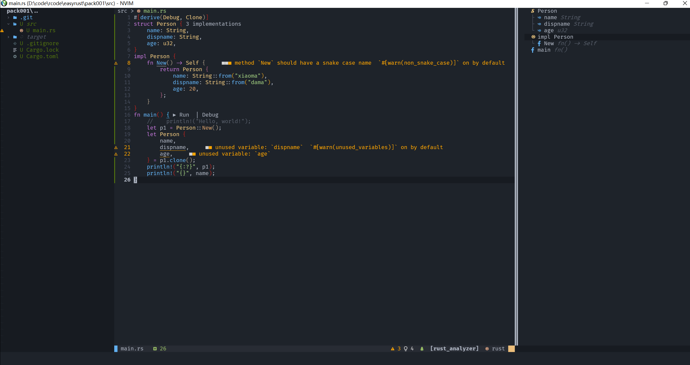

# lvim

Custom lvim config

lvim 自定义配置
-----------------------------------------
> 使用LunarVim作为基础
- [LunarVim: Code on Neovim](#lunarvim-code-on-neovim)
  - [前言](#前言)
  - [安装](#安装)
  - [功能介绍](#功能介绍)
    - [目录结构](#目录结构)
    - [功能列表](#目录列表)
  - [效果](#效果)
## 前言
最近感觉手腕疼，网上搜索了一下，得了鼠标手，开始折腾多用键盘编程方式。

先后尝试过 helix，nvchad等开源项目，感觉helix可定制行太差，临时用一下比较可以。
nvchad也是开起来好看，如果要安装新的包什么的也不是很方便.

后面尝试了一下LunarVim，感觉还不错。

折腾良久，不喜勿喷！

配合[neovide](https://github.com/neovide/neovide)效果更酷炫，默认脚本已设置好字体。
## 安装
如何安装，参考，lunarvim 的文档。
https://www.lunarvim.org/

首先你需要安装字体[nerd-fonts](https://github.com/ryanoasis/nerd-fonts),不然安装好，也会图标显示不出来。

你需要安装[LunarVim](https://www.lunarvim.org/01-installing.html#installation)，安装依赖包括:

1. [neovim-0.7](https://github.com/neovim/neovim/releases)或以上版本
2. [git](https://git-scm.com/downloads)
3. [python pip](https://pip.pypa.io/en/stable/installation/)
4. [nodejs npm](https://www.npmjs.com/)
5. [rust cargo](https://www.rust-lang.org/)(可选，你可以手动安装 ripgrep 和 fd-find)
### linux 用户
```sh
bash <(curl -s https://raw.githubusercontent.com/lunarvim/lunarvim/master/utils/installer/install.sh)
```
### windows 用户

```sh
Invoke-WebRequest https://raw.githubusercontent.com/LunarVim/LunarVim/master/utils/installer/install.ps1 -UseBasicParsing | Invoke-Expression
```
用我这个定制包，只需要替换你用户目录的lvim文件夹即可，
首次运行，需要，运行
```sh
  :PackerSync
```

## 功能介绍
我这个自定义配置，主要为了方便自己编码，完全没有考虑调试代码的情况
### 目录结构
```txt
lvim/
    config.lua          配置入口和一些LunarVim内建配置
    lua/
      builtin.lua      内建配置
      ulualine.lua      lualine状态栏配置
      plugins.lua      安装的插件
```
### 功能列表
| 快捷键 | 名字 | 功能 |
|  ----  | ----  | ----  |
|F1 |diagnostic| 到错误行上，显示详细错误信息|
|F2 |WhichKey| 快捷键帮助|
|F3|Telescope live_grep_args|  全文搜索 使用方式同 rg带参数搜索，这个不能按照程序方式进行搜索|
|F4|SymbolsOutline| 大纲模式，在右侧显示 函数、结构等信息|
|F5|Telescope treesitter| 搜索的时候使用 treesitter来进行，面向程序|
|F6|terminal| 命令行窗口，打开后，i进行输入 |
|Z|zen-mode| 装逼模式，试试就知道|
|ctrl+v|Telescope paste|在Telescope提示窗口粘贴|
|sdy|surround|编辑字符串|
|.|repeat|重复|
||rainbow|彩虹配对，默认打开|
|<空格> +e |neovimtree | 文件浏览器|

> 更详细的功能，多按F2

### 效果


